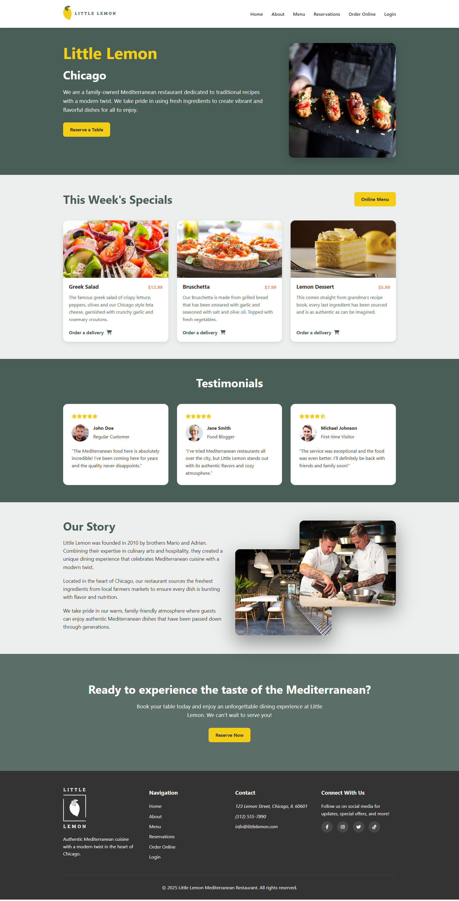
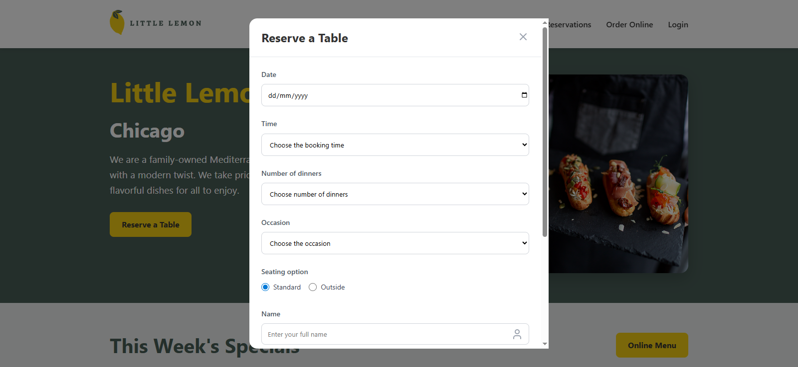
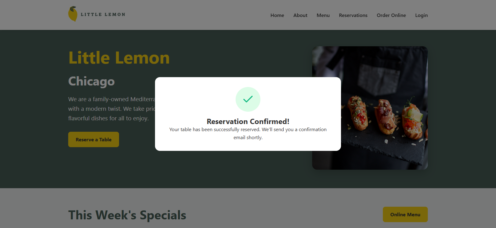

# Little Lemon Restaurant: Front-End Capstone Project

This project is the capstone for the **[Meta Front-End Developer Professional Certificate](https://www.coursera.org/professional-certificates/meta-front-end-developer)** on Coursera. It's a single-page application for a Mediterranean restaurant called "Little Lemon," designed to showcase fundamental front-end development skills.

---

## 📚 Project Overview

The application is a fully responsive website built using React. It features a modern, clean design and includes key sections like a hero area, specials menu, customer testimonials, and a reservation form. The project demonstrates proficiency in building dynamic user interfaces and managing component state.

---

## ✨ Features

* **Responsive Design:** The layout adapts seamlessly to different screen sizes, from mobile phones to desktops.
* **Interactive Menu Cards:** The special menu items feature a subtle hover effect for an engaging user experience.
* **Modal Reservation Form:** A dynamic form for booking a table, including input validation and a success message.
* **Reusable Components:** The application is built with React components to ensure the code is modular and easy to maintain.

---

## 💻 Live Demo

You can view a live demo of the application here:

[**Live Demo Link**](https://salahdev25.github.io/Meta-Front-End-Developer-Capstone/index.html)

---

## 📸 Screenshots

Here you can add screenshots of the application to show its different sections and responsive behavior.

* Desktop View 1: 
* Desktop View 2: 
* Desktop View 3: 

---

## ▶️ How to Run Locally

1.  **Clone the repository:**
    ```bash
    git clone https://github.com/salahdev25/Meta-Front-End-Developer-Capstone.git
    ```
2.  **Navigate to the project directory:**
    ```bash
    cd Meta-Front-End-Developer-Capstone
    ```
3.  **Install dependencies:**
    ```bash
    npm install
    ```
4.  **Start the development server:**
    ```bash
    npm start
    ```

The application will be available at `http://localhost:3000`.
